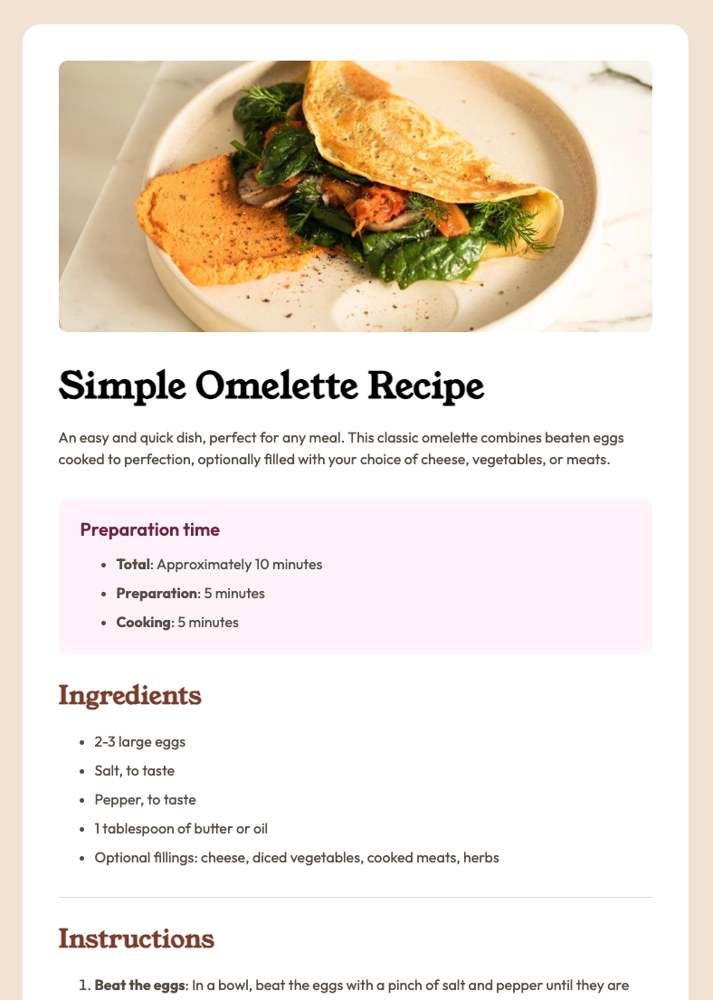

# Frontend Mentor - Recipe page solution

This is a solution to the [Recipe page challenge on Frontend Mentor](https://www.frontendmentor.io/challenges/recipe-page-KiTsR8QQKm). Frontend Mentor challenges help you improve your coding skills by building realistic projects. 

## Table of contents

- [Overview](#overview)
  - [The challenge](#the-challenge)
  - [Screenshot](#screenshot)
  - [Links](#links)
- [My process](#my-process)
  - [Built with](#built-with)
  - [What I learned](#what-i-learned)
  - [Continued development](#continued-development)
  - [Useful resources](#useful-resources)
  - [AI Collaboration](#ai-collaboration)
- [Author](#author)

## Overview

### Screenshot

### Links

- Solution URL: [Add solution URL here](https://github.com/MichalGajda/fm-recipe-page)
- Live Site URL: [Add live site URL here](https://michalgajda.github.io/fm-recipe-page/)

## My process

### Built with

- Semantic HTML5 markup
- CSS custom properties
- Flexbox
- CSS Grid
- [React](https://reactjs.org/) - JS library

### What I learned

- I tried to make more fine-grained distribution of css classes.
- Logical representatives of margin, padding, width, height

### Continued development

- Try even more fine-grained css classes distribution next time.

### AI Collaboration

- Used GitHub Copilot for code-review. 

## Author

- Website - [Michał Gajda](https://github.com/MichalGajda)
- Frontend Mentor - [@MichalGajda](https://www.frontendmentor.io/profile/MichalGajda)
